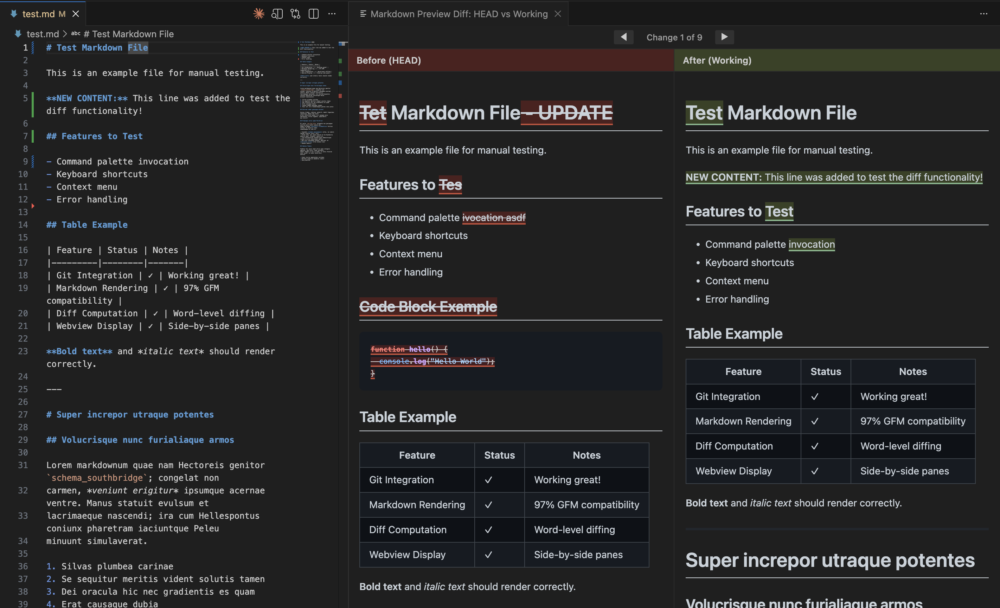

# Markdown Preview Diff

**See your markdown changes as they'll appear—not as raw text.**

[](https://code.visualstudio.com/)
[](https://opensource.org/licenses/MIT)

---

## The Problem

Reviewing markdown changes in raw text diffs is painful:

```diff
- ## Features
+ ## Key Features
- This extension provides **side-by-side** comparison.
+ This extension provides **side-by-side** rendered comparison.
```

You see cryptic `+` and `-` lines, but you can't tell how your documentation will actually *look* after the changes. Is that table still aligned? Did that code block render correctly? Will that image display properly?

## The Solution

Markdown Preview Diff shows your changes as **rendered HTML**, side-by-side—just like GitHub's preview diff, but right inside VS Code.



## Key Benefits

- **See the real impact** - View changes as rendered markdown, not confusing raw text
- **Stay in your editor** - No context-switching to GitHub or external tools
- **Catch visual bugs** - Spot broken tables, missing images, and formatting issues instantly
- **Review with confidence** - Know exactly how your documentation will appear to readers
- **Navigate efficiently** - Jump between changes with keyboard shortcuts

---

## Features

### Core Capabilities

| Feature | Description |
|---------|-------------|
| **Side-by-Side Rendered Comparison** | See before and after versions as beautifully rendered HTML, not raw markdown text |
| **Git Integration** | Compare your working changes against the last commit (HEAD) or staged changes |
| **Visual Diff Highlighting** | Additions highlighted in green, deletions in red—applied directly to rendered content |
| **Word-Level Change Detection** | Precise highlighting shows exactly which words changed within paragraphs |

### Navigation & Interaction

| Feature | Description |
|---------|-------------|
| **Change Navigation** | Jump between changes with `N` (next) and `P` (previous) keys |
| **UI Navigation Buttons** | Click-to-navigate buttons in the diff view header |
| **Synchronized Scrolling** | Both panes scroll together to keep context aligned |
| **Real-Time Updates** | Diff view automatically refreshes when you save changes |

### Markdown Support

| Feature | Description |
|---------|-------------|
| **GitHub-Flavored Markdown** | Full GFM support including tables, task lists, strikethrough, and autolinks |
| **Syntax Highlighting** | Code blocks rendered with proper syntax highlighting (192+ languages) |
| **Rich Content** | Images, links, blockquotes, horizontal rules, and nested lists all render correctly |
| **Inline Formatting** | Bold, italic, code, and combined formatting preserved in diff view |

### Configuration

| Feature | Description |
|---------|-------------|
| **Comparison Target** | Choose to compare against HEAD (last commit) or staged changes |
| **Highlight Styles** | Default subtle highlighting or high-contrast mode for accessibility |
| **Scroll Sync Toggle** | Enable or disable synchronized scrolling between panes |
| **Render Timeout** | Configurable timeout for very large files |

---

## Usage

### Opening the Diff View

**Command Palette:**
1. Open a markdown file (`.md`)
2. Press `Cmd+Shift+P` (Mac) or `Ctrl+Shift+P` (Windows/Linux)
3. Type "Markdown: Open Preview Diff" and press Enter

**Keyboard Shortcut:**
| Platform | Shortcut |
|----------|----------|
| macOS | `Cmd+K D` |
| Windows/Linux | `Ctrl+K D` |

**Context Menu:**
Right-click in a markdown file and select "Markdown: Open Preview Diff"

### Navigating Changes

Once the diff view is open and focused:

| Action | Key | Description |
|--------|-----|-------------|
| Next Change | `N` | Jump to the next change |
| Previous Change | `P` | Jump to the previous change |

You can also use the navigation buttons in the diff view header.

### Customizing Settings

1. Open VS Code Settings (`Cmd+,` / `Ctrl+,`)
2. Search for "Markdown Preview Diff"
3. Adjust settings to your preference

Or edit `settings.json` directly:

```json
{
  "markdownPreviewDiff.defaultComparisonTarget": "HEAD",
  "markdownPreviewDiff.syncScroll": true,
  "markdownPreviewDiff.highlightStyle": "default",
  "markdownPreviewDiff.renderTimeout": 5000
}
```

---

## Configuration Reference

| Setting | Type | Default | Description |
|---------|------|---------|-------------|
| `markdownPreviewDiff.defaultComparisonTarget` | `"HEAD"` \| `"staged"` | `"HEAD"` | Compare against last commit (`HEAD`) or staged changes (`staged`) |
| `markdownPreviewDiff.syncScroll` | `boolean` | `true` | Synchronize scrolling between before and after panes |
| `markdownPreviewDiff.highlightStyle` | `"default"` \| `"high-contrast"` | `"default"` | Color scheme for diff highlighting. Use `high-contrast` for better visibility |
| `markdownPreviewDiff.renderTimeout` | `number` | `5000` | Maximum milliseconds to wait for rendering (1000-10000) |

### Configuration Examples

**Compare against staged changes instead of HEAD:**
```json
{
  "markdownPreviewDiff.defaultComparisonTarget": "staged"
}
```

**High-contrast mode for accessibility:**
```json
{
  "markdownPreviewDiff.highlightStyle": "high-contrast"
}
```

**Disable synchronized scrolling:**
```json
{
  "markdownPreviewDiff.syncScroll": false
}
```

---

## Requirements

| Requirement | Minimum Version | Notes |
|-------------|-----------------|-------|
| VS Code | 1.60.0+ | Required for Webview API features |
| Git | 2.x | Must be installed and available in PATH |

**Additional Requirements:**
- The markdown file must be in a Git repository
- The file must have changes compared to HEAD or staged content

---

## Architecture Overview

For developers curious about how the extension works:

### Technology Stack

| Component | Technology | Purpose |
|-----------|------------|---------|
| Language | TypeScript 5.x | Type-safe extension development |
| Markdown | [Marked](https://marked.js.org/) 17.x | GitHub-flavored markdown rendering (97% GFM compatibility) |
| Diff Engine | [diff](https://github.com/kpdecker/jsdiff) 8.x | Word-level text diff computation (Myers algorithm) |
| Syntax Highlighting | [highlight.js](https://highlightjs.org/) 11.x | Code block syntax highlighting (192 languages) |
| Git Operations | [simple-git](https://github.com/steveukx/git-js) 3.x | Repository detection and file version retrieval |
| UI | VS Code Webview API | Side-by-side HTML rendering |

### Component Flow

```
┌─────────────────────────────────────────────────────────────────────┐
│                         User Command                                 │
│                    (Cmd+K D / Ctrl+K D)                             │
└──────────────────────────┬──────────────────────────────────────────┘
                           │
                           ▼
┌─────────────────────────────────────────────────────────────────────┐
│                       Git Service                                    │
│              Retrieve HEAD/staged + working versions                 │
└──────────────────────────┬──────────────────────────────────────────┘
                           │
                           ▼
┌─────────────────────────────────────────────────────────────────────┐
│                      Diff Computer                                   │
│               Word-level diff computation                            │
└──────────────────────────┬──────────────────────────────────────────┘
                           │
                           ▼
┌─────────────────────────────────────────────────────────────────────┐
│                    Markdown Renderer                                 │
│              Render both versions to HTML                            │
└──────────────────────────┬──────────────────────────────────────────┘
                           │
                           ▼
┌─────────────────────────────────────────────────────────────────────┐
│                     Diff Highlighter                                 │
│            Inject visual markers into rendered HTML                  │
└──────────────────────────┬──────────────────────────────────────────┘
                           │
                           ▼
┌─────────────────────────────────────────────────────────────────────┐
│                       Webview Panel                                  │
│            Display side-by-side with sync scrolling                  │
└─────────────────────────────────────────────────────────────────────┘
```

### Data Flow

1. **Command triggered** → Extension receives request for current markdown file
2. **Git retrieval** → Fetch committed/staged version + read working file content
3. **Diff computation** → Calculate word-level differences between versions
4. **Markdown rendering** → Convert both markdown versions to HTML
5. **Highlight injection** → Apply visual diff markers to rendered HTML
6. **Webview display** → Render side-by-side in VS Code panel with navigation

---

## Performance

### Targets

| Metric | Target | Notes |
|--------|--------|-------|
| Extension Activation | < 500ms | Lazy activation on markdown files |
| Diff Rendering (< 10KB) | < 2 seconds | Typical documentation files |
| Diff Rendering (< 100KB) | < 5 seconds | Large documents with progress indicator |
| Memory Usage | < 50MB per view | Single active view pattern |

### Monitoring

Performance metrics are logged to the "Markdown Preview Diff" output channel:
1. Open Output panel: `View → Output` or `Cmd+Shift+U` / `Ctrl+Shift+U`
2. Select "Markdown Preview Diff" from the dropdown

---

## Troubleshooting

### Common Issues

**Diff view not opening?**
- Ensure the file is a markdown file (`.md` extension)
- Verify the file is in a Git repository (`git status` should work)
- Check that the file has changes compared to HEAD

**Slow rendering?**
- Large files (> 100KB) naturally take longer
- Check the Output panel for performance bottlenecks
- Increase `renderTimeout` setting if needed

**Git errors?**
- Verify Git is installed: `git --version`
- Ensure the repository is healthy: `git status`
- Check that the file is tracked by Git

**Extension not activating?**
- Open any `.md` file to trigger activation
- Try `Developer: Reload Window` command
- Check the Extensions view for any error indicators

---

## Contributing

Found a bug or have a feature request? Please open an issue on [GitHub](https://github.com/nick-railsback/VSCode-Markdown-Preview-Diff/issues).

---

## License

[MIT](https://opensource.org/licenses/MIT)

---

**Enjoy reviewing your markdown changes!**
